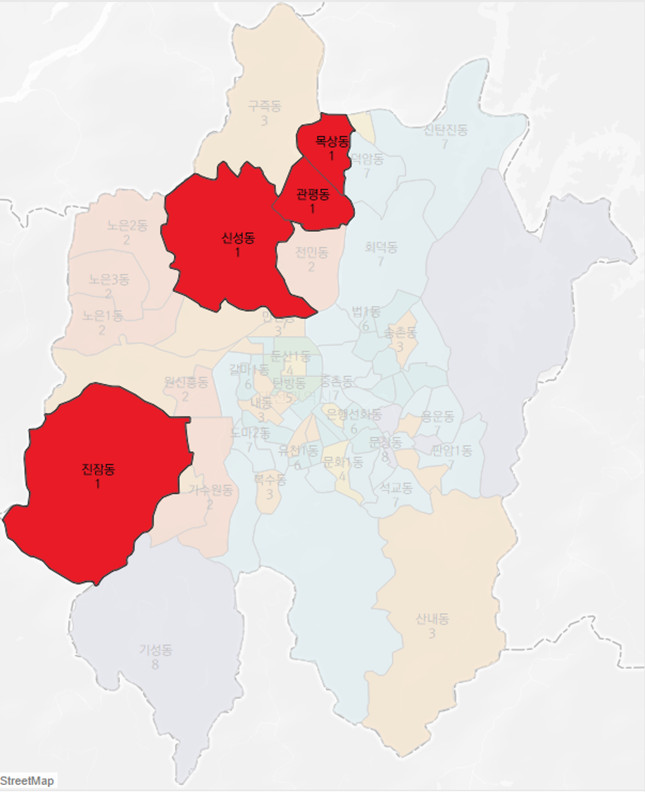
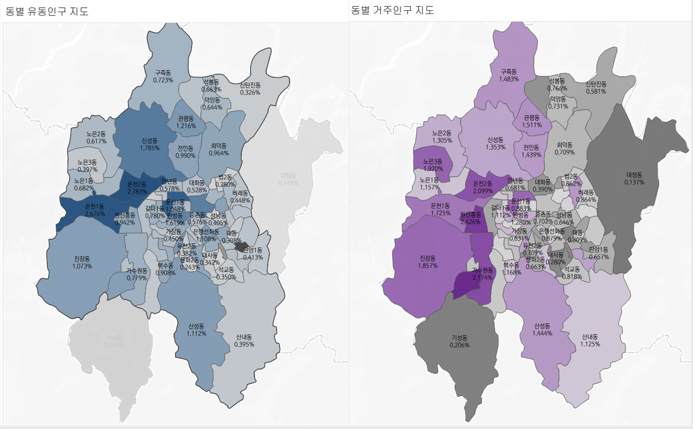
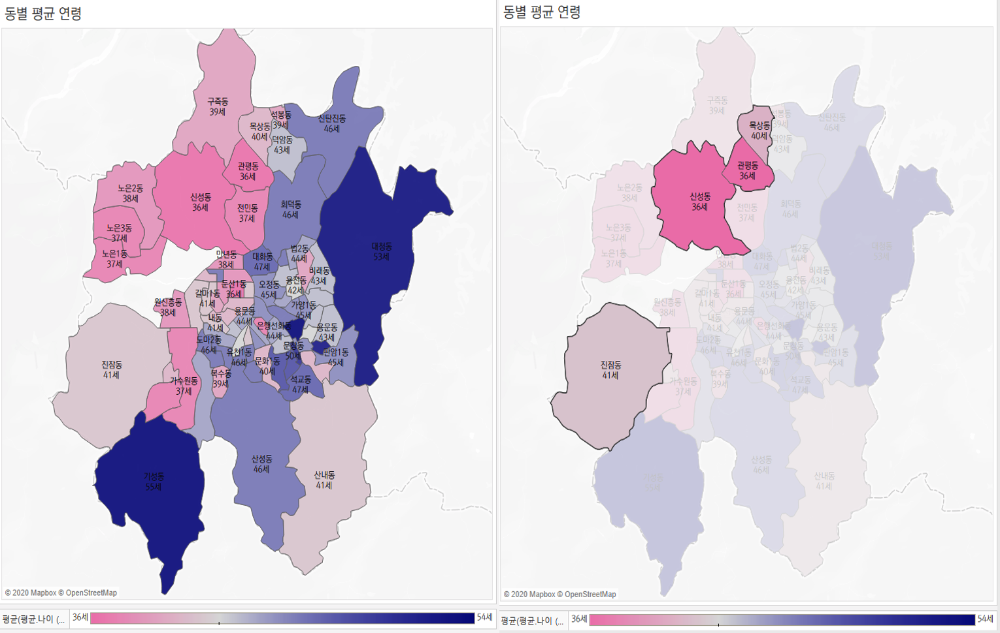

<h1 align="center"><strong>🔎 2020년 대전시 빅데이터 공모전</strong></h3>

`#python` `#Tableau` `#R` `#SOM(Self-Organizing-Map)`

---

# 🚦 1. 소개
- 공모전: 2020년 대전시에서 주최한 빅데이터 공모전
- 주제: 유동인구 데이터, 약국 근무데이터, 대전시 지리데이터를 활용해서 대전시 내에서 의료취약 지역을 찾자
- 참가자: 김지환, 유건욱, 유세은, 정현우

### 사용데이터
- 대전시 유동인구 데이터 (출처: KT)
- 대전시 거주인구 연령별 비율 (출처: KOSIS)
- 휴일지킴이 약국 요일별 주소, 운영시간 정보 (출처: 휴일지킴이약국)
- 전국 상가상권정보 (출처: 공공데이터포털)
- 대전시 500m 단위 node

---

# 🚦 2. 분석과정

## 2-1) 데이터 전처리
* **대전시 유동인구 / 거주인구**\
행정동별로 유동인구와 거주인구와의 비율을 구하였음

* **20대 미만 인구 / 전체 거주인구**\
전체 거주인구 중에서 유소년의 비율이 어느정도 있는지 계산하였음

* **행정동별 속한 node의 개수**\
실제로 거주인구, 유동인구가 발생할 수 있는 node가 행정동별로 얼마나 많은지 고려하였음

* **Node당 평균 영업약국 수**\
node 1개당 평균 영업중인 약국이 얼마나 있는지 고려하였음

* **행정동별 평균나이**\
별도의 전처리 과정을 거치지 않았음

## 2-2) 사용기법
- SOM (Self-organizing Map)  
\
위의 지표들을 바탕으로 SOM을 돌려서 취약지역을 살펴보았음
- Tableau, Python, QGIS, R

---

# 🚦 3. 결과
 

\
- 정리해보면 관평동, 목삼동, 신성동, 진잠동 4개동이 다른 지역에 비해서 유소년 의료서비스가 취약한 지역임을 알 수 있었다. 
- 거주인구 중에서 유소년 인구의 비율이 다른 지역에 비해서 높았으며, 유동인구도 많았으며 주거지역 500m당 평균 영업약국 개수가 1개미만으로 가장 적었다. 또한 유소년 인구 비율이 많고 유동인구가 많은 지역인데 반해 약국에 대한 지리적 접근성이 현저히 떨어진다는 점에서 이 4개동이 유소년 의료서비스 취약지역이었다.

---

# 🚦 4. 파일 설명
- [1. crawling phar data.ipynb](https://github.com/hw79chopin/Daejeon-bigdata-contest/blob/master/jupyter/1.%20crawling%20phar%20data.ipynb) : 휴일지킴이약국에서 최근 1년동안 대전시 약국의 시간별 영업여부에 대해서 크롤링한 코드
- [2. preprocess (population).ipynb](https://github.com/hw79chopin/Daejeon-bigdata-contest/blob/master/jupyter/2.%20preprocess%20(population).ipynb) : 대전시 거주인구, 유동인구를 Tableau에 쓰기 적합하게 전처리하는 코드
- [3. scatter phar, grid points.ipynb](https://github.com/hw79chopin/Daejeon-bigdata-contest/blob/master/jupyter/3.%20scatter%20phar%2C%20grid%20points.ipynb) : 약국을 대전시 지도에 흩뿌리고, 500m 간격으로 대전시에 grid를 만드는 코드
- [4. cacultae weakness index.ipynb](https://github.com/hw79chopin/Daejeon-bigdata-contest/blob/master/jupyter/4.%20caculate%20weakness%20index.ipynb) : 시간대별로 대전시 전 행정동에 영업중인 약국의 개수를 계산하는 코드
- [5. clustering.ipynb](https://github.com/hw79chopin/Daejeon-bigdata-contest/blob/master/jupyter/5.%20clustering.ipynb) : SOM, K-means, hierarchical clustering을 통해서 의료취약지역을 찾아내는 코드

---

# 🚦 5. 참고문헌
[1] 국가통계포털, 홈페이지, http://kosis.kr/statHtml/statHtml.do?orgId=117&tblId=DT_117N_A00404&conn_path=I3  
[2] 청소년기본법, 홈페이지, http://www.law.go.kr/%EB%B2%95%EB%A0%B9/%EC%B2%AD%EC%86%8C%EB%85%84%EA%B8%B0%EB%B3%B8%EB%B2%95  
[3] 김현경, <미국 유럽 ‘어린이 괴질’ 속출 영국 14세 소년 사망>, 한국경제, 2020  
[4] 임진혁, <美·유럽 퍼진 '소아 괴질' 서울서도 의심사례 2건>, 서울경제, 2020  
[5] coronaboard, 홈페이지, https://coronaboard.kr/  
[6] 이경주, 임준홍, <의료서비스 취약지역 탐색을 위한 분석방법론 구축 및 실증분석 연구: 충남지역을 사례로>, 한국도시행정학회, 2015  
[7] 500m 산정기준은 시속 4~5Km/h로 걸어서 의료서비스 기관까지 도달하는데 10분 내외로 도착할 수 있는 거리  
[8] Good Pharmacy Practice. 1993년 세계보건기구(WHO)에서 발표한 우수약무기준 선언문   
[9] 송종경, 유봉규, <우리나라 지역약국 약료서비스의 접근성 현황>, 가천대학교 약학대학, 2014  
[10] Daniel Weiss, <Health-System Pharmacists: Key Platers in a Changing Health Care System>, Pharmacy Times, 2013  
[11] 휴일지킴이약국, 홈페이지, https://www.pharm114.or.kr/search/search_result.asp  
[12] 손소영, 2020, Data Mining Theory & Application 2020-1  
[13] Admdongkor <대한민국 행정동 지도> https://github.com/vuski/admdongkor  
[14] 최재필, <맛집 문 열었나?… 한전, 파워온 서비스가 알려준다>, 전자신문, 2019  
  
<h3 align="center"><strong>끗! 🙌</strong></h3>
